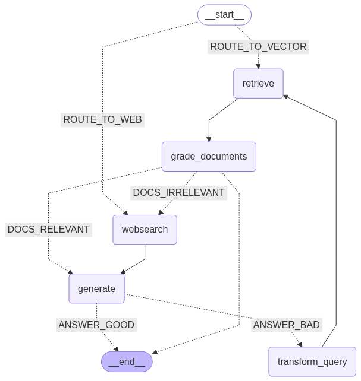

# Advanced RAG with LangGraph

An intelligent Retrieval-Augmented Generation (RAG) system powered by LangGraph, Llama 3.3, and NVIDIA NIM endpoints. This application combines document retrieval, web search, and intelligent routing to provide accurate, grounded answers to user queries.

## 🎯 Overview

This project implements an **Agentic RAG Pipeline** that goes beyond traditional RAG by adding:

- **Intelligent Query Routing**: Automatically routes queries to either vector store (for domain knowledge) or web search (for current information)
- **Document Relevance Grading**: Validates retrieved documents against the query
- **Hallucination Detection**: Ensures generated answers are grounded in retrieved documents
- **Query Transformation**: Re-writes queries for better retrieval when initial results are unsatisfactory
- **Interactive UI**: Streamlit-based interface for easy document upload and query interaction



## 🏗️ System Architecture

```
start
  ↓
route_question (Conditional)
  ├→ vectorstore → retrieve → grade_documents → decide_to_generate
  │                                    ↓
  │                          websearch → generate
  │
  └→ websearch → generate
        ↓
  grade_generation_v_documents_and_question
    ├→ useful → end
    ├→ not_supported → transform_query → retrieve
    └→ not_useful → transform_query → retrieve
```

## 🔑 Key Features

### 1. **Multi-Source Retrieval**
   - Vector store retrieval from uploaded documents (PDF, TXT, DOCX)
   - Web search for real-time information via Tavily API
   - Automatic source selection based on query content

### 2. **Intelligent Grading System**
   - **Document Relevance Grader**: Filters out irrelevant retrieved documents
   - **Hallucination Grader**: Checks if generated answers are grounded in facts
   - **Answer Quality Grader**: Validates if answers actually address the question

### 3. **Query Optimization**
   - Automatic query rewriting for better semantic relevance
   - Fallback mechanisms when initial retrieval fails
   - Iterative refinement loops

### 4. **Interactive Streamlit UI**
   - Simple document upload (PDF, TXT, DOCX)
   - URL-based document loading
   - Chat history tracking
   - Document preview capability

## 🚀 Getting Started

### Prerequisites
- Python 3.8+
- NVIDIA API Key (for Llama 3.3 and embeddings)
- Tavily API Key (for web search)

### Installation

1. **Clone the repository**
```bash
git clone <https://github.com/Abdul-Khadar-Jilani/Advanced_RAG.git>
cd advanced_rag
```

2. **Install dependencies**
```bash
pip install -r requirements.txt
```

3. **Set environment variables**
```bash
# Create a .env file or set these in your shell
export NVIDIA_API_KEY="your_nvidia_api_key"
export TAVILY_API_KEY="your_tavily_api_key"
```

### Dependencies

- `langchain-nvidia-ai-endpoints` - NVIDIA's LLM and embedding endpoints
- `langgraph` - Agentic workflow orchestration
- `langchain-community` - Community integrations for document loaders and vectorstores
- `faiss-cpu` - Vector similarity search
- `tavily-python` - Web search API client
- `langgraph-checkpoint-sqlite` - Graph state persistence
- `streamlit` - Web UI framework
- `pypdf` - PDF document loading
- `bs4` - HTML parsing for web loading

## 📖 Usage

### Option 1: Streamlit Web UI (Recommended)

```bash
streamlit run app.py
```

Then:
1. Upload documents (PDF, TXT, DOCX) via the sidebar
2. Optionally add URLs for web-based documents
3. Ask questions in the main chat interface
4. View responses and chat history

### Option 2: Direct Python Usage

```python
from langgraph_rag import run_rag_agent

question = "What are the key concepts in prompt engineering?"
answer = run_rag_agent(question)
print(answer)
```

### Option 3: Using the RAG Module

```python
from rag import run_rag_agent

question = "Tell me about adversarial attacks on LLMs"
answer = run_rag_agent(question)
print(answer)
```

## 📁 Project Structure

```
advanced_rag/
├── app.py                 # Streamlit web application
├── langgraph_rag.py      # Core RAG pipeline with LangGraph
├── rag.py                # Alternative RAG implementation
├── main.py               # Entry point
├── requirements.txt      # Project dependencies
├── README.md             # This file
└── pyproject.toml        # Project configuration
```

## 🔄 Workflow Details

### Node Functions

1. **route_question**: Determines whether to use vector store or web search based on query analysis
2. **retrieve**: Fetches documents from the vector store using semantic similarity search
3. **grade_documents**: Validates relevance of retrieved documents to the original question
4. **generate**: Creates an answer using the RAG prompt template with retrieved context
5. **grade_generation_v_documents_and_question**: Checks for hallucinations and validates answer quality
6. **transform_query**: Rewrites questions for better semantic relevance in retrieval
7. **web_search**: Performs web search when vector store results are insufficient

### Decision Points

- **route_question**: Routes to "websearch" or "vectorstore" based on query analysis
- **decide_to_generate**: Chooses between generating answer or performing web search based on document relevance
- **grade_generation_v_documents_and_question**: Returns "useful", "not_supported", or "not_useful"

### Data Flow

1. User query enters the system
2. Router classifies query (vectorstore vs web search)
3. If vectorstore: Documents retrieved → Relevance graded → Generate answer
4. If web_search: Web results fetched → Used for generation
5. Generated answer checked for:
   - Hallucinations (grounded in facts?)
   - Relevance (addresses the question?)
6. If answer is poor: Query is transformed and cycle repeats
7. If answer is good: Returned to user

## 🛠️ Configuration

### Model Settings
```python
# LLM Configuration
model="meta/llama-3.3-70b-instruct"
temperature=0.2          # Low for consistent answers
top_p=0.7
max_completion_tokens=1024

# Embeddings
model="nvidia/nv-embedqa-e5-v5"
```

### Vector Store Settings
```python
# Text Splitting
chunk_size=1000          # Characters per chunk
chunk_overlap=200        # Overlap between chunks

# Web Search
web_search_results=3     # Results per query (k=3)
```

## 🔐 API Keys Setup

### NVIDIA API Key
1. Visit [NVIDIA AI Foundation Models](https://api.nvidia.com/)
2. Sign up and get your API key
3. Set environment variable:
```bash
export NVIDIA_API_KEY="your_key_here"
```

### Tavily API Key
1. Visit [Tavily Search API](https://tavily.com/)
2. Create account and get API key
3. Set environment variable:
```bash
export TAVILY_API_KEY="your_key_here"
```

## 📊 Example Queries

### Query 1: Real-time Information
```
Question: "What is the current weather in Hyderabad, India?"
→ Routes to web_search (requires real-time data)
```

### Query 2: Domain Knowledge
```
Question: "Explain the concept of prompt engineering"
→ Routes to vectorstore (if documents available)
```

### Query 3: Complex Question
```
Question: "What are adversarial attacks on LLMs and how can we defend against them?"
→ Uses vectorstore, refines query if needed, validates answer quality
```

## 🧪 Testing

Run the built-in test suite:

```bash
python langgraph_rag.py
```

This will execute test questions and display the workflow execution:
- Shows routing decisions
- Displays document retrieval
- Shows grading results
- Prints final generated answer

### Sample Test Output
```
---ROUTE QUESTION---
Question: What is the current weather in Hyderabad India?
Route to: websearch
---ROUTE QUESTION TO WEB SEARCH---
---WEB SEARCH---
---GENERATE---
Final Answer: [Generated response with web search results]
```

## 🐛 Troubleshooting

### API Key Errors
**Problem**: `AuthenticationError` or `Invalid API key`
- **Solution**: Verify keys are correctly set in environment
```bash
echo $NVIDIA_API_KEY
echo $TAVILY_API_KEY
```

### Vector Store Issues
**Problem**: `ImportError: No module named 'faiss'`
- **Solution**: Install FAISS
```bash
pip install faiss-cpu
```

### Document Loading Errors
**Problem**: Cannot load PDF/DOCX files
- **Solution**: Install document loaders
```bash
pip install pypdf python-docx unstructured
```

### URL Loading Issues
**Problem**: `Error loading URL: Connection refused`
- **Solution**: Check internet connectivity and URL validity

### Memory Issues
**Problem**: Out of memory when processing large documents
- **Solution**: Reduce `chunk_size` or process documents in batches

## 📈 Performance Tips

1. **Optimize Chunk Size**: Smaller chunks = more retrieval calls but better precision
2. **Adjust Temperature**: Lower temperature = more consistent, higher = more creative
3. **Limit Web Search**: Fewer results = faster response time
4. **Use Caching**: Implement result caching for common queries

## 🚀 Deployment

### Local Development
```bash
streamlit run app.py
```

### Cloud Deployment (Using Docker)

**Dockerfile**:
```dockerfile
FROM python:3.10-slim

WORKDIR /app

# Install system dependencies
RUN apt-get update && apt-get install -y \
    build-essential \
    && rm -rf /var/lib/apt/lists/*

# Copy and install Python dependencies
COPY requirements.txt .
RUN pip install --no-cache-dir -r requirements.txt

# Copy application files
COPY . .

# Set environment variables (provide at runtime)
ENV NVIDIA_API_KEY=""
ENV TAVILY_API_KEY=""

# Expose Streamlit port
EXPOSE 8501

# Run Streamlit
CMD ["streamlit", "run", "app.py", "--server.port=8501", "--server.address=0.0.0.0"]
```

**Build and Run**:
```bash
docker build -t advanced-rag .

docker run \
  -e NVIDIA_API_KEY=$NVIDIA_API_KEY \
  -e TAVILY_API_KEY=$TAVILY_API_KEY \
  -p 8501:8501 \
  advanced-rag
```

### Deploy to Cloud Platforms

**Hugging Face Spaces**:
- Create new Space → Select Streamlit
- Upload files and requirements.txt
- Set secrets in Space settings (API keys)
- App auto-deploys

**Railway/Render/Heroku**:
- Push to GitHub
- Connect repository to platform
- Set environment variables in platform dashboard
- Deploy!

## 📝 License

This project is open source. MIT, Apache 2.0.

## 🤝 Contributing

Contributions are welcome! Please:
1. Fork the repository
2. Create a feature branch (`git checkout -b feature/amazing-feature`)
3. Make your changes
4. Commit (`git commit -m 'Add amazing feature'`)
5. Push to branch (`git push origin feature/amazing-feature`)
6. Open a Pull Request

## 📞 Support

For issues and questions:
- Open an issue on GitHub
- Check existing documentation
- Review [LangGraph Docs](https://langchain-ai.github.io/langgraph/)
- Review [LangChain Docs](https://python.langchain.com/)

## 🔗 References

- [LangGraph Documentation](https://langchain-ai.github.io/langgraph/)
- [LangChain Documentation](https://python.langchain.com/)
- [NVIDIA AI Foundation Models](https://www.nvidia.com/en-us/ai/)
- [Tavily Search API](https://tavily.com/)
- [Streamlit Documentation](https://docs.streamlit.io/)

## 📚 Related Concepts

The project references and is inspired by these excellent articles:
- [Agents by Lilian Weng](https://lilianweng.github.io/posts/2023-06-23-agent/) - Understanding autonomous agents
- [Prompt Engineering](https://lilianweng.github.io/posts/2023-03-15-prompt-engineering/) - Effective prompting techniques
- [Adversarial Attacks on LLMs](https://lilianweng.github.io/posts/2023-10-25-adv-attack-llm/) - Security considerations

## 🎓 Learning Path

1. **Start with UI**: Run `streamlit run app.py` to understand the interface
2. **Explore Core Logic**: Read `langgraph_rag.py` to understand workflow
3. **Modify Prompts**: Customize prompts in `langgraph_rag.py` for your use case
4. **Extend Features**: Add new nodes or modify decision logic
5. **Deploy**: Use Docker or cloud platform for production

---

**Last Updated**: December 2025  
**Status**: Active Development  
**Python Version**: 3.8+  

**Happy RAG-ing! 🎉**
